# Entity-Relationship Diagram (Mermaid Format)

```mermaid
erDiagram
    USERS ||--o{ APPLICANTS : "has"
    USERS ||--o{ AUDIT_LOGS : "creates"
    USERS ||--o{ HUMAN_REVIEWS : "reviews"
    
    APPLICANTS ||--o{ APPLICATIONS : "submits"
    
    APPLICATIONS ||--o{ DOCUMENTS : "contains"
    APPLICATIONS ||--o{ VALIDATION_REPORTS : "has"
    APPLICATIONS ||--o{ SCORES : "has"
    APPLICATIONS ||--o{ RECOMMENDATIONS : "receives"
    APPLICATIONS ||--o{ FAIRNESS_CHECKS : "undergoes"
    APPLICATIONS ||--o{ HUMAN_REVIEWS : "receives"
    APPLICATIONS ||--o{ AUDIT_LOGS : "triggers"
    
    DOCUMENTS ||--o{ OCR_RESULTS : "produces"
    
    POLICY_RULES ||--o{ APPLICATIONS : "governs"

    USERS {
        int id PK "Primary Key"
        string full_name "100 chars"
        string email UK "Unique, indexed"
        string password_hash "255 chars"
        string role "Applicant, Underwriter, CreditManager, Auditor"
        boolean is_active
        datetime created_at
        datetime updated_at
    }

    APPLICANTS {
        int id PK, FK "Foreign Key to users.id with CASCADE"
        string phone "20 chars, optional"
        string date_of_birth "20 chars, optional"
        string address "255 chars, optional"
        string gender "20 chars, optional"
        float monthly_income "Default: 0.0"
        string employer_name "100 chars, optional"
        string employment_type "Default: Salaried"
        int employment_stability_months "Default: 0"
        int credit_score "Default: 0"
        datetime created_at
        datetime updated_at
    }

    APPLICATIONS {
        int id PK "Primary Key"
        int applicant_id FK "Foreign Key to applicants.id with CASCADE"
        float loan_amount
        string loan_purpose "255 chars, optional"
        int term_months
        float monthly_debt_obligations "Default: 0.0"
        string status "DRAFT, SUBMITTED, IN_PROGRESS, PENDING_REVIEW, APPROVED, DECLINED, REFER"
        datetime created_at
        datetime updated_at
    }

    DOCUMENTS {
        int id PK "Primary Key"
        int application_id FK "Foreign Key to applications.id with CASCADE"
        string document_type "Aadhaar, PAN, SalarySlip, BankStatement, EmploymentLetter"
        string file_path "255 chars"
        string status "UPLOADED, PROCESSING, PASSED, FAILED"
        string error_message "255 chars, optional"
        datetime uploaded_at
    }

    OCR_RESULTS {
        int id PK "Primary Key"
        int document_id FK "Foreign Key to documents.id with CASCADE"
        text raw_text
        json parsed_json "Extracted fields"
        float confidence_score "Default: 1.0"
        datetime extracted_at
    }

    VALIDATION_REPORTS {
        int id PK "Primary Key"
        int application_id FK "Foreign Key to applications.id with CASCADE"
        float name_match_score "Default: 1.0"
        float dob_match_score "Default: 1.0"
        boolean income_consistency_pass "Default: true"
        boolean is_expired "Default: false"
        boolean is_unreadable "Default: false"
        string status "PASS, FAIL, HOLD"
        json details_json
        datetime created_at
    }

    SCORES {
        int id PK "Primary Key"
        int application_id FK "Foreign Key to applications.id with CASCADE"
        float debt_to_income_ratio
        int employment_stability_months
        int credit_score
        float income_stability_rating
        float documentation_quality_score
        float risk_score
        datetime calculated_at
    }

    RECOMMENDATIONS {
        int id PK "Primary Key"
        int application_id FK "Foreign Key to applications.id with CASCADE"
        string recommendation "APPROVE, REFER, DECLINE"
        float confidence_score "0.0 to 1.0"
        text explanation
        json policy_citations
        json reasons_json
        datetime generated_at
    }

    FAIRNESS_CHECKS {
        int id PK "Primary Key"
        int application_id FK "Foreign Key to applications.id with CASCADE"
        string blind_recommendation "APPROVE, REFER, DECLINE"
        boolean is_fair
        string fairness_status "PASS, FAIRNESS_FAILURE"
        json blind_scores_json
        datetime checked_at
    }

    HUMAN_REVIEWS {
        int id PK "Primary Key"
        int application_id FK "Foreign Key to applications.id with CASCADE"
        int reviewer_id FK "Foreign Key to users.id with SET NULL"
        string decision "APPROVED, DECLINED, REFER"
        text comments "Optional"
        datetime reviewed_at
    }

    AUDIT_LOGS {
        int id PK "Primary Key"
        int application_id FK "Foreign Key to applications.id with SET NULL"
        string action "UPLOAD, OCR_EXTRACT, POLICY_CHECK, BIAS_TEST, HUMAN_DECISION"
        int user_id FK "Foreign Key to users.id with SET NULL"
        json details_json "State snapshot"
        string snapshot_hash "64 chars, checksum"
        datetime created_at
    }

    POLICY_RULES {
        int id PK "Primary Key"
        string rule_name "100 chars"
        string rule_key UK "50 chars, unique"
        float threshold_value
        string rule_description "255 chars, optional"
        boolean is_active "Default: true"
        datetime created_at
        datetime updated_at
    }
```

## Key Relationships Summary

| Parent | Child | Cascade | Foreign Key |
|--------|-------|---------|------------|
| users | applicants | CASCADE | applicants.id → users.id |
| applicants | applications | CASCADE | applications.applicant_id → applicants.id |
| applications | documents | CASCADE | documents.application_id → applications.id |
| applications | validation_reports | CASCADE | validation_reports.application_id → applications.id |
| applications | scores | CASCADE | scores.application_id → applications.id |
| applications | recommendations | CASCADE | recommendations.application_id → applications.id |
| applications | fairness_checks | CASCADE | fairness_checks.application_id → applications.id |
| applications | human_reviews | CASCADE | human_reviews.application_id → applications.id |
| applications | audit_logs | SET NULL | audit_logs.application_id → applications.id |
| documents | ocr_results | CASCADE | ocr_results.document_id → documents.id |
| users | human_reviews | SET NULL | human_reviews.reviewer_id → users.id |
| users | audit_logs | SET NULL | audit_logs.user_id → users.id |

## Database Constraints

### Primary Keys
- All tables have a primary key on the `id` column (except applicants which uses users.id)

### Unique Constraints
- `users.email` - Unique email per user
- `policy_rules.rule_key` - Unique policy rule key

### Indexes
- All foreign key columns are indexed for performance
- Primary key columns are indexed
- Unique constraint columns are indexed
- Email column is indexed for fast lookups

### Cascade Rules
- **CASCADE**: Deleting a parent record deletes all child records
  - User deletion → cascades to applicant, audit logs
  - Applicant deletion → cascades to applications and their children
  - Application deletion → cascades to documents, reports, scores, recommendations, reviews
  - Document deletion → cascades to OCR results

- **SET NULL**: Deleting a parent record sets foreign key to NULL
  - User deletion (as reviewer) → human_reviews.reviewer_id becomes NULL
  - User deletion (as actor) → audit_logs.user_id becomes NULL
  - Application deletion → audit_logs.application_id becomes NULL (separate path)
