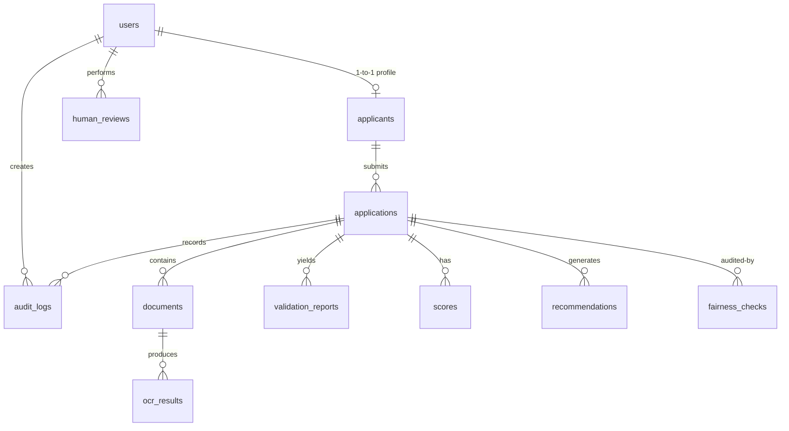

# Database Schema

Apex Credit implements a normalized SQLite database containing 13 tables.

---

## Entity-Relationship Diagram

---

## Core Tables Details

### 1. `users`
Represents system profiles:
- `id` (INTEGER, Primary Key)
- `full_name` (VARCHAR)
- `email` (VARCHAR, Unique)
- `password_hash` (VARCHAR)
- `role` (VARCHAR: `Applicant`, `Underwriter`, `CreditManager`, `Auditor`)
- `is_active` (BOOLEAN)

### 2. `applicants`
Stores credit profiles:
- `id` (INTEGER, FK to `users.id`, Primary Key)
- `phone` (VARCHAR)
- `date_of_birth` (VARCHAR)
- `monthly_income` (FLOAT)
- `employer_name` (VARCHAR)
- `employment_type` (VARCHAR)
- `credit_score` (INTEGER)

### 3. `applications`
Loan records submitted:
- `id` (INTEGER, Primary Key)
- `applicant_id` (INTEGER, FK to `applicants.id`)
- `loan_amount` (FLOAT)
- `loan_purpose` (VARCHAR)
- `term_months` (INTEGER)
- `monthly_debt_obligations` (FLOAT)
- `status` (VARCHAR: `DRAFT`, `SUBMITTED`, `PENDING_REVIEW`, `APPROVED`, `DECLINED`, `HOLD`)

### 4. `policy_rules`
Active thresholds for credit checks:
- `id` (INTEGER, Primary Key)
- `rule_key` (VARCHAR, Unique)
- `rule_name` (VARCHAR)
- `threshold_value` (FLOAT)
- `rule_description` (VARCHAR)
- `is_active` (BOOLEAN)

### 5. `audit_logs`
Cryptographically signed system trace records:
- `id` (INTEGER, Primary Key)
- `application_id` (INTEGER, FK to `applications.id`)
- `action` (VARCHAR)
- `details_json` (JSON)
- `snapshot_hash` (VARCHAR: Recalculated SHA-256 hash of log details)
