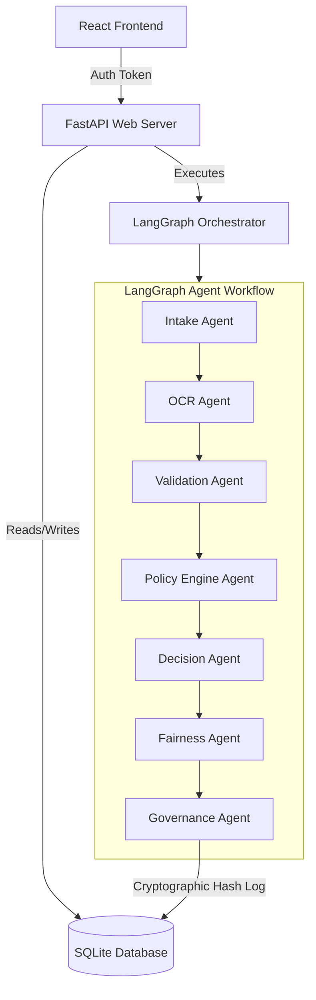

# System Architecture

Apex Credit is structured as an N-tier system, separating AI workflows, security layers, API services, and client interfaces.

---

## Architecture Flow

---

## Core Components

1. **Vite React UI Client**: Role-based views (Applicant, Underwriter, Manager, Auditor, Demo). Leverages Recharts for interactive credit data and Framer Motion for execution step animations.
2. **FastAPI Web Host**: Serving REST endpoints. Integrates static mounts for document previews and executes the workflow asynchronously.
3. **LangGraph StateGraph Engine**: Coordinates multi-agent messaging passing and conditional branch flows. If required documents are missing, the Validation Agent branches directly to a `HOLD` state, skipping policy scoring.
4. **Governance Verification**: Every step of the agent workflow creates an `AuditEntry`. These logs are aggregated, stringified, and signed with SHA-256 hashes to guarantee data immutability.
5. **Security Gate**: Intercepts LLM calls, checking inputs against a regex array of prompt injection indicators (e.g. VIP override requests).
